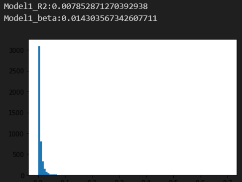

# 日内动量在金融信息发布日的影响
# 文件清单
- `DateInfoProcessAndAnalyse`
    - `Data` 
        - `result.csv`:由`test.ipynb`生成，存储的是交易日和对应的loss_ratio，按照loss_ratio由小到大排序
        - `dateData.csv`:获取的金融信息以及对应的日期，数据来源于国家统计局官网，中国人民银行官网以及国务院官网
        - `dateDataPosition.csv`:结合`result.csv`和`dateData.csv`，存储相关日期的loss_ratio的位次(即线性拟合的程度),loss_ratio,金融信息,按照position从小到大排序
        - `dateDataPositionContent.csv`:`getFinanceDateData.py`爬取的内容,并且结合了`result.csv`的内容，存储了排序,loss_ratio,以及金融信息内容
        - `stockDateData.csv`:`getStockDateData.py`爬取的内容,并且结合了`result.csv`的内容，存储了排序,loss_ratio,以及金融信息内容
        - `getFinanceDateData.py`:爬取新华财经的相关热点财经资讯
        - `getStockDateData.py`:爬取中国经济信息网上的财经报道
    - `analyseDateInfoForwords.py`:结合`dateDataPosition.csv`计算相关日期的线性拟合程度(loss_ratio衡量),并且和所有的样本的分布进行对比，观察是否会有不同
    - `analyseDateInfoBackwords.py`:结合`stockDateData.csv`进行NLP,分析金融文字信息对于线性拟合度好坏的贡献
    - `test.ipynb`:对2021到2023三年间的所有股票在所有交易日的线性回归分析，并且计算了每一个交易日的loss_ratio的值(取mean)
    - `README.md`:说明以及分析文档
    - `image`相关的结果图片
# 步骤以及结果
## 1.分析线性模型
### 文件
`test.ipynb`
### 内容
对2021到2023三年间的所有股票在所有交易日的线性回归分析，并且计算了每一个交易日的loss_ratio的值(取mean),在此期间，处理了缺失值(由于样本量较大，以及对于线性模型的输入参数的长度一致性的控制，这里选择直接剔除的方案)。
### 结果

### 分析

## 2.爬取并且处理数据
### 文件
`getFinanceDateData.py`,`getStockDateData.py`
### 内容
爬取新华财经的相关热点财经资讯，爬取中国经济信息网上的财经报道。其中前者的信息量较少，因此并没有进行相关研究。后续研究的是后者。
### 结果
见`data`文件夹中的相关csv文件
### 分析
在爬取途中，发现国内很多金融网站的相关历史文字信息数据不完善；与之形成横向的对比，微博等社交平台上相关的信息透明、完善，我觉得这个也可以作为一个输入来判断信息对于线性模型的作用，更进一步，甚至可以将其作为一个因子。可惜受限于时间，在此并没有进行相关的工作。

## 3.前向和后向分析验证
### 文件
`analyseDateInfoForwords.py`,`analyseDateInfoBackwords.py`
### 内容
- 结合`dateDataPosition.csv`计算相关日期的线性拟合程度(loss_ratio衡量),并且和所有的样本的分布进行对比，观察是否会有不同
- 结合`stockDateData.csv`进行NLP,将每一天的信息进行处理，构建随机森林分类器，分析金融文字信息对于线性拟合度好坏的贡献
### 结果
- 前向

- 后向

### 分析

# 总结
